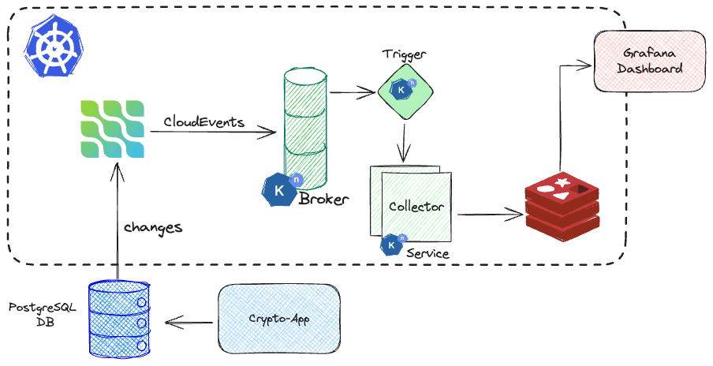

# Debezium Knative demo
This repository contains a demo, originally presented at [DevConf 2024](https://www.devconf.info/cz/),
showcasing the use of Debezium Server as Knative source.

## Problem Domain
The demo showcases the use of [Debezium Server](https://debezium.io/documentation/reference/stable/operations/debezium-server.html) to capture changes to cryptocurrency data from database of legacy application,
and streams them to knative broker as [CloudEvents](https://cloudevents.io/). A knative service then stores cryptocurrency prices
from these events as time-series data in Redis.


## Prerequisities

1. Obtain Kubernetes Cluster with [Installed Knative (eventing, serving)](https://knative.dev/docs/install/)
2. Create namespaces
```shell
kubectl create -f k8s/0001_namespaces.yml
```
3. Install Debezium Operator

```shell
helm repo add debezium https://charts.debezium.io
helm install debezium-operator debezium/debezium-operator --version 2.7.0-beta1 -n crypto-demo
```

4. Install Grafana operator

```shell
helm install grafana-operator oci://ghcr.io/grafana/helm-charts/grafana-operator --version v5.6.3 -n crypto-infra
```

## Deploying the Legacy Crypto Application
For demonstration purposes the "legacy" application will be deployed in its
own Kubernetes namespaces.

```shell
kubectl -n crypto-legacy create -f k8s/crypto-legacy/0001_postgres.yml
kubectl -n crypto-legacy create -f k8s/crypto-legacy/0002_crypto-app.yml
```

## Deploy Monitoring Infrastructure and Redis

```shell
kubectl -n crypto-infra create -f k8s/crypto-infra
kubectl -n crypto-infra create -f k8s/crypto-infra/grafana
```

## Deploying CDC, Collector Application, and Metrics
Finally we are ready to deploy the cornerstone of our solution.

```shell
# Deploy Knative broker
kubectl -n crypto-demo create -f k8s/crypto-demo/0001_broker.yml

# Deploy the CDC component
kubectl -n crypto-demo create -f k8s/crypto-demo/0002_crypto-cdc.yml

# Deploy collector service
kubectl -n crypto-demo create -f k8s/crypto-demo/0003_crypto-collector.yml
```

When everything starts a time-series data for each cryptocurrency coin will
be persisted in our Redis. To get a better representation of what is happening
we can create Grafana dashboards for both -- the Debezium Server CDC component
as well another dashboard which visualises the time-series data from redis.

```shell
# Debezium Server dashboard
kubectl -n crypto-infra create -f k8s/crypto-demo/dashboards/0001_dashboard-cdc.yaml

# Cryptocurrency data dashboard
kubectl -n crypto-infra create -f k8s/crypto-demo/dashboards/0002_dashboard-redis.yaml
```

To access these dashboards you can expose the Grafana instance to your localhost like this:
```
kubectl -n crypto-infra  port-forward services/grafana-service 3000:3000
```

Then simply visit `http://localhost:3000/` and log in
using `root` as username  and `secret` as password.